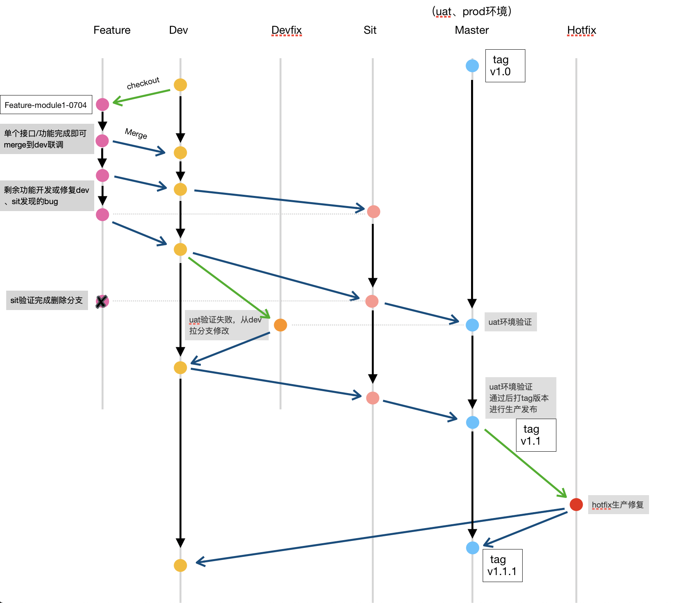
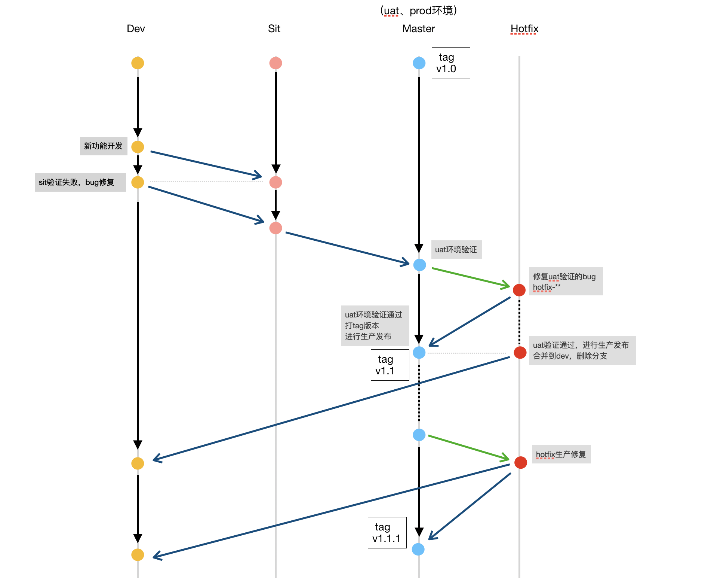

### 介绍
基于git flow分支策略制定的分支规范，由于我们有不同环境，每个环境的代码版本会有所区别，合理控制各环境分支代码有助于避免环境功能混乱

### 常设分支
| 分支名 | 对应环境 | 自动部署 | 说明 |
| --- | --- | --- | --- |
| dev | 开发联调 | 是 | 新功能开发不直接在该分支上进行开发，需拉feature分支 |
| sit | 集成测试 | 是 | 从dev分支合并 |
| master | UAT/生产环境  | 否  | 从sit或hotfix分支合并，UAT验证后打tag版本，进行生产发布 |

### 临时分支

| 分支名 | 命名规则 | 分支来源 | 功能 | 说明 | 
| --- | --- | --- | --- | --- |
| hotfix-* | hotfix-{修复版本号}  | master | 修复需紧急上线的bug | 修改后合并到dev、master分支|
| feature-* | feature-{功能描述}-{日期MMdd}  | dev | 用于新功能开发 | 本地验证功能后合并到dev， 当sit通过验证后删除该分支|
| devfix-* | devfix-{功能描述}  | dev | 修复uat环境验证失败的功能 | 修复后重新走联调流程，uat验证通过删除该分支|

### tag版本说明
```
master分支tag版本格式： vX.Y[.Z], 起始版本号: v1.0[.0]
X: 主版本号，发布了不兼容的功能修改，主版本号+1
Y: 次版本号，发布了向下兼容的修改（新增功能），次版本号+1
Z: 修订号， 对bug的修复或微小调整，修订号+1, 起始版本可以不写修订号，只有进行过修复后才是必须

```

### 分支开发流程(中台, 基础服务)

> （重要）： 常设分支的代码合并需遵循该顺序 dev -> sit -> master 

1. 新项目开发（master）：在master分支上直接开发第一个版本，开发完成后分出dev分支进行验证

2. 新功能开发(feature)：通过dev分支分出新的feature功能分支进行开发, 完成功能开发并确保编译、单元测试以及本地验证通过后，合并到dev分支（单个功能/接口验证完成即可合并到dev）

3. 开发联调(dev)：
   * 联调成功： 单个功能联调成功后即可合并到sit分支进行集成测试
   * 联调失败： 在相应的future分支上修改并重新merge到dev分支重新联调
     
4. 集成测试(sit)： 
   * 测试通过： 项目管理员合并到master主干进行用户验收，删除feature分支
   * 测试失败： 在相应的future分支上修改并重新merge到dev分支重新联调走流程
   
5. 用户验收(master)： 
   * 验收通过： 项目管理员打tag版本，进行生产发布
   * 验收失败： 从dev分支分出devfix分支进行修复重回dev联调流程验证或等待下版本验收(按需版本回退)
   
6. 生产发布(master)： 
   * 生产bug修复： 从master分支拉取hotfix分支，修复bug后合并到dev、[sit]、master，完成生产发布后再次打tag标记版本号，删除相应的hotfix分支



### 分支开发流程(聚合服务, 前端)
1. 新项目开发（dev）：新项目可直接在master分支进行开发，联调测试时再分出新的分支

2. 功能开发/非生产bug修复(dev)：在dev分支进行功能开发以及bug修复，验证通过后提交代码
     
3. 集成测试(sit)： 项目管理员合并到sit分支进行集成测试
   * 测试通过： 项目管理员合并到master主干进行用户验收
   * 测试失败： 开发人员在dev分支上直接修改，验证后重新提交代码，重走集成测试流程
   
4. 用户验收(master)： 
   * 验收通过： 项目管理员打tag版本，进行生产发布
   * 验收失败： 开发人员在dev分支上直接修改，验证后重新提交代码，重走集成测试流程
   
5. 生产发布(master)： 
   * 生产bug修复： 从master分支拉取hotfix分支，项目管理员合并到dev、master分支，完成生产发布后再次打tag标记版本号，删除相应的hotfix分支


### git命令示例

```
  切换至dev分支
  git checkout dev

  同步最新代码
  git pull origin dev

  从dev分支开一条feature分支
  git checkout -b feature-module1-0704

  功能开发完成合并到dev
  git checkout dev
  git merge --no-ff feature-module1-0704

  dev分支push到远端完成自动部署
  git push origin dev
  
```

### git推荐工具
Sourcetree