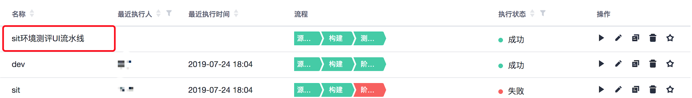

# 流水线使用指南

目前流水线实现了CI、CD功能。

## 自动触发

根据团队规范，`sit` 分支对应 `sit` 环境。

需要在`sit`环境验证功能时，直接将 `dev` 合并到 `sit` 环境即可自动触发流水线。

## 手动触发

下面以测评项目举例。

1、 登录软开云 devcloud

2、 鼠标hover到对应项目上，点击流水线。

3、 进入流水线列表，选择对应前端流水线任务执行。
所有前端流水线命名规律均为：

`xxx环境`+`xxx项目`+UI流水线

4、右侧点击执行。

# Q && A

1、Q：流水线执行不成功。

  A：联系流水线创建者。
